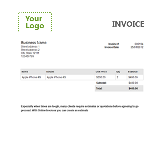
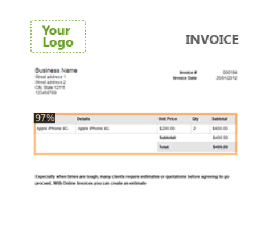
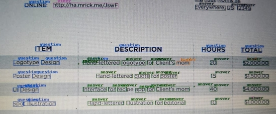

# Finding Tables

> An end to end Deep Learning approach for table detection and structure recognition from invoice documents

## 1. Introduction
Finding Tables is an automatic table recognition method for interpretation of tabular data in document images. We present an improved deep learning-based end to end approach for solving both problems of table detection and structure recognition using a finetuned model on our invoice data which is already pretrained on TableBank. Finding Tables is a Faster RCNN High-Resolution Network that detects the regions of tables. For our structure recognition we propose an entirely novel approach leveraging the SOTA methods in NLP. We basically feed in the image and we get question answers pairs and on the basis of that we can transform it into tables.

## 2. Setting it all up 

 
Setting up LayoutLM:

<pre>

git clone -b remove_torch_save https://github.com/NielsRogge/unilm.git
cd unilm/layoutlm
pip install unilm/layoutlm
git clone https://github.com/huggingface/transformers.git
cd transformers
pip install ./transformers
</pre>

<b>Code is developed under following library dependencies</b>  

Torch==1.7.0+cu101  
Torchvision==0.8.1+cu101 
Cuda = 10.1 

  To install Detectron V2
<pre>
pip install detectron2 -f https://dl.fbaipublicfiles.com/detectron2/wheels/cu101/torch1.7/index.html
</pre>

 

  Installing other dependencies
<pre>
pip install -r requirements.txt
</pre>

 

 Please download weights for Detectron V2 and LayoutLM and keep it data folder
 

Detectronv2 weights: <a href="https://drive.google.com/file/d/1Mn9E4Ylrc-p850TqhCbAK2OF6ltSxSUv/view?usp=sharing"> Detectron_finetuned_model_weights </a> 

LayoutLM <a href="https://drive.google.com/file/d/1ec84bdkRZ2aSatGBSbph3SHND-rsMF_A/view?usp=sharing"> LayoutLM weights </a>

## 3. Running inference

To test custom images on our model, go inside the folder and run the command "python run_inference.py 00017.PNG (path of image file)"

## 4. Examples

Original Image:

Detecting Images:

Example from Structure Recognition:

 

If you are having troubles getting it to work, please feel free to contact me or raise an issue

 

Neham (nehamjain2002@gmail.com) & Tanay (dixittanay@gmail.com)
